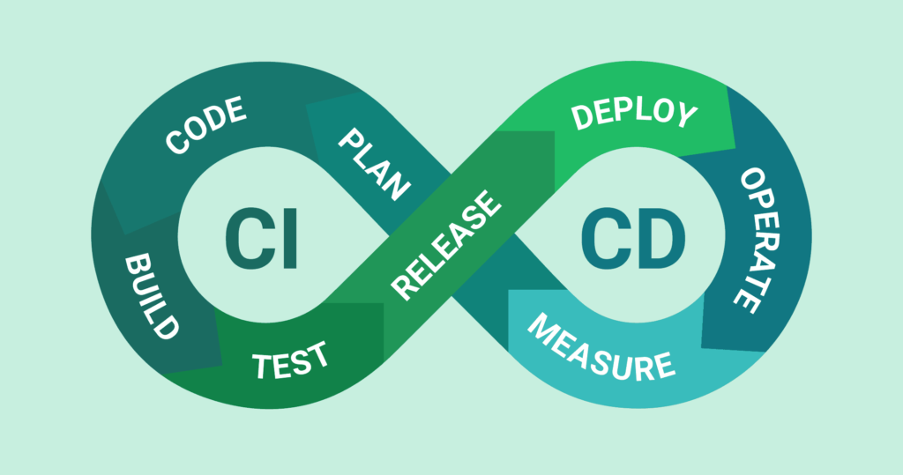

# [)](https://git.io/typing-svg)

    

Fluxo de um processo de CI/CD

Os passos para configurar um processo de **CI/CD** (Integração Contínua e Entrega Contínua) podem variar dependendo das ferramentas e da infraestrutura utilizadas, mas o fluxo básico envolve algumas etapas principais.

Esses 8 passos fazem parte de um processo de CI/CD mais amplo, geralmente alinhado ao ciclo de vida do DevOps. A metodologia é focada na automação, colaboração e ciclos de feedback rápidos. Vamos detalhar cada um deles:

### 1. **PLAN (Planejar)**
   - **Descrição**: Essa fase envolve o planejamento de novos recursos, mudanças ou correções a serem feitas no sistema. É o momento de definir os requisitos do projeto, prioridades e alinhar a visão com a equipe e stakeholders.
   - **Exemplo**: Uma equipe de desenvolvimento decide adicionar um novo recurso, como "autenticação por biometria" no aplicativo. Eles discutem como será implementado, quais serão os requisitos e as metas de lançamento.

### 2. **CODE (Codificar)**
   - **Descrição**: Na fase de codificação, os desenvolvedores escrevem o código para implementar as funcionalidades planejadas. É o estágio em que o trabalho de programação real acontece.
   - **Exemplo**: Os desenvolvedores começam a escrever o código para a autenticação biométrica, utilizando bibliotecas específicas para autenticação de impressões digitais ou reconhecimento facial no código.

### 3. **BUILD (Compilar/Construir)**
   - **Descrição**: Após o código ser escrito, ele precisa ser construído (ou compilado), o que significa transformar o código em um artefato executável. É a etapa em que se verifica se o código compila corretamente e se as dependências estão resolvidas.
   - **Exemplo**: O código que foi escrito é compilado em um arquivo executável ou em um contêiner Docker, e são verificadas as dependências externas, como pacotes ou bibliotecas, garantindo que o código esteja pronto para ser testado.

### 4. **TEST (Testar)**
   - **Descrição**: A fase de testes envolve a execução de testes automatizados para garantir que o código funcione como esperado. Isso pode incluir testes unitários, testes de integração, testes de aceitação e outros tipos.
   - **Exemplo**: Após o código ser compilado, são executados testes automatizados (por exemplo, com JUnit ou PyTest) para verificar se a autenticação biométrica funciona corretamente e se não há regressões no sistema.

### 5. **RELEASE (Liberar)**
   - **Descrição**: O código aprovado nos testes é preparado para ser liberado para o ambiente de produção. Durante essa fase, a equipe de desenvolvimento gera a versão do software que será disponibilizada para os usuários finais. É aqui que se organiza a versão do produto.
   - **Exemplo**: A equipe gera uma versão "1.2.0" do aplicativo, que inclui a funcionalidade de autenticação biométrica, e se prepara para a implantação nos ambientes de produção e staging.

### 6. **DEPLOY (Implantar)**
   - **Descrição**: O código liberado é implantado em um ambiente de produção ou em outros ambientes, como staging, para que possa ser acessado pelos usuários finais. A implantação pode ser feita de maneira automatizada para garantir consistência.
   - **Exemplo**: O código é implantado no ambiente de produção, onde a nova funcionalidade de autenticação biométrica é acessada pelos usuários. Ferramentas de orquestração como Kubernetes ou plataformas de CI/CD, como Jenkins ou GitLab CI, podem ser usadas para gerenciar o processo de implantação.

### 7. **OPERATE (Operar)**
   - **Descrição**: Depois que o código é implantado, a equipe deve monitorar o sistema em produção para garantir que ele esteja funcionando corretamente. Isso inclui a monitoração de performance, segurança e estabilidade, bem como o gerenciamento de incidentes ou falhas.
   - **Exemplo**: Após a implantação da funcionalidade, os engenheiros de operações monitoram logs e métricas para garantir que não haja falhas no sistema e que o novo recurso de autenticação esteja funcionando bem para os usuários.

### 8. **MEASURE (Medir)**
   - **Descrição**: A última fase do ciclo envolve a coleta e análise de dados sobre o comportamento do sistema em produção. Isso inclui medir a performance, a satisfação do usuário, erros ocorridos e outras métricas importantes. Essas informações são usadas para aprender e melhorar continuamente o processo de desenvolvimento.
   - **Exemplo**: A equipe monitora métricas como o número de tentativas de autenticação biométrica bem-sucedidas, o tempo de resposta do sistema e o feedback dos usuários. Se necessário, ajustes e melhorias são feitas com base nos dados coletados.

---

Esses 8 passos formam um ciclo contínuo que permite a evolução constante do software de maneira rápida e confiável. Ao medir e operar em ciclos curtos, é possível melhorar a qualidade do produto e ajustar rapidamente a estratégia de desenvolvimento conforme os feedbacks.